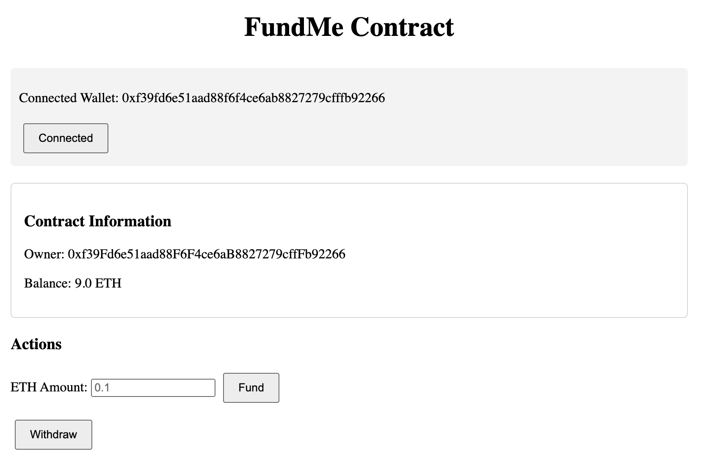

# FundMe Smart Contract

This project implements a crowdfunding smart contract using the Foundry development framework. Users can fund the contract with ETH (minimum $5 USD), and the contract owner can withdraw the accumulated funds. Based on the Cyfrin Foundry Fundamentals course Section 2.

## Features

- ETH/USD price conversion using Chainlink Price Feeds
- Minimum funding amount of $5 USD in ETH
- Automated unit tests and integration tests
- Multi-chain deployment support (Sepolia, Mainnet, Local)
- Mock price feed for local testing
- Gas optimization
- Withdrawal functionality (owner only)

## Installation

1. Clone the repository
```bash
git clone <your-repo-url>
cd foundry-simple-storage-xl
```

2. Install Foundry
```bash
curl -L https://foundry.paradigm.xyz | bash
foundryup
```

3. Install dependencies
```bash
forge install
```

4. Set up environment variables
```bash
cp .env.example .env
# Add your API keys and private key to .env:
# SEPOLIA_RPC_URL=
# PRIVATE_KEY=
# ETHERSCAN_API_KEY=
```

## Front-end Interface

The project includes a front-end interface for interacting with the FundMe contract. 

Here's how to set it up:

### Running the Front-end

1. Start a local Anvil chain:
```bash
anvil
```

2. Deploy the FundMe contract to your local chain:
```bash
forge script script/DeployFundMe.s.sol --rpc-url http://localhost:8545 --private-key <PRIVATE_KEY> --broadcast
```
Note: Replace `<PRIVATE_KEY>` with one of the private keys provided by Anvil.

3. Get contract address & abi
- Deployed infos will be available under `broadcast` folder, get contract address
- Run `forge inspect FundMe abi` to get the abi, 

4. Navigate to the front-end directory and start a live server:
```bash
cd front-end
# Use VS Code's Live Server extension or any other local server to serve index.html
```

### Interacting with the Interface

Once running, you'll see a user interface with the following features:
- Wallet connection status and address
- Contract information (owner address and current balance)
- Fund input field to send ETH to the contract
- Withdraw button for the contract owner

The interface allows you to:
- Connect your MetaMask wallet
- View contract details
- Fund the contract with ETH (minimum $5 USD equivalent)
- Withdraw funds (owner only)

## Video Tutorial

For a step-by-step guide on setting up and using the FundMe smart contract, check out the following YouTube video:

<iframe width="560" height="315" src="https://www.youtube.com/embed/AEWEwzIrf24?si=oPYR1yIavYf_zB5Q" title="YouTube video player" frameborder="0" allow="accelerometer; autoplay; clipboard-write; encrypted-media; gyroscope; picture-in-picture; web-share" referrerpolicy="strict-origin-when-cross-origin" allowfullscreen></iframe>

## Deployed Contracts

Sepolia Testnet: [`0x9fc8a80eF33bCcDD0cD45a34129C513E11b234ea`](https://sepolia.etherscan.io/address/0x9fc8a80eF33bCcDD0cD45a34129C513E11b234ea)

## Usage (Sepolia Testnet for example)

### Deploy to Sepolia Testnet

```bash
make deploy-sepolia
```

### Fund the Contract

```bash
forge script script/Interactions.s.sol:FundFundMe --rpc-url $SEPOLIA_RPC_URL --private-key $PRIVATE_KEY --broadcast
```

### Withdraw Funds (Owner Only)

```bash
forge script script/Interactions.s.sol:WithdrawFundMe --rpc-url $SEPOLIA_RPC_URL --private-key $PRIVATE_KEY --broadcast
```

## Testing

### Run All Tests

```bash
forge test
```

### Run Specific Tests

```bash
# Unit tests
forge test --match-path test/unit/FundMeTest.t.sol

# Integration tests
forge test --match-path test/Integration/InteractionsTest.t.sol
```

### Test Coverage

```bash
forge coverage
```

## Project Structure

- `src/`: Smart contract source files
  - `FundMe.sol`: Main contract implementation
  - `PriceConverter.sol`: ETH/USD conversion library
- `test/`: Test files
  - `unit/`: Unit tests
  - `Integration/`: Integration tests
  - `mock/`: Mock contracts for testing
- `script/`: Deployment and interaction scripts
- `broadcast/`: Deployment artifacts

## Configuration

The contract can be deployed to different networks using `HelperConfig.s.sol`:

- Sepolia Testnet
- Ethereum Mainnet
- Local Anvil chain (with mock price feed)

## Contributing

1. Fork the repository
2. Create a feature branch
3. Commit your changes
4. Push to the branch
5. Open a Pull Request

## License

MIT

## Acknowledgements

- [Cyfrin Foundry Course](https://github.com/Cyfrin/foundry-full-course-cu)
- [Chainlink Price Feeds](https://docs.chain.link/data-feeds/price-feeds/addresses)
- [Foundry Documentation](https://book.getfoundry.sh/)
